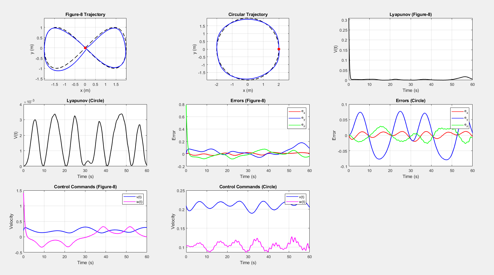
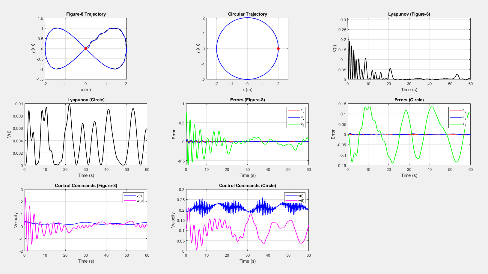
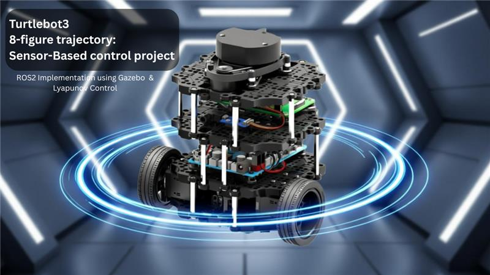

# Sensor Based Control project of a robust control of a two wheeled mobile robot with kinematic disturbances

## Introduction

These codes are part of our Sensor-Based Control course project. The objective was to design a robust nonlinear controller for a two-wheeled mobile robot. Our implementation uses Lyapunov-based methods to compute tracking errors and generate control commands. The goal was for the robot to successfully follow circular and figure-eight trajectories, and to recover its intended path when subjected to disturbances.
We validated our controller through simulations in MATLAB and ROS 2, using Gazebo for the physics simulation and on a real TurtleBot3 platform. Follow the steps below to reproduce our results.

## Requirements

- **ROS2** (Humble / Foxy depending on your setup)  
- **TurtleBot3 packages**  
- **Gazebo** simulation environment  
- A **TurtleBot3 Burger** (for real-world execution)

Make sure the TurtleBot3 environment variables are correctly set.

## To launch the demo on Gazebo:

Ensure your workspace is built with:

```bash
cd ~/turtlebot_ws

source install/setup.bash

colcon build
```

On terminal 1: 

```bash
export TURTLEBOT3_MODEL=burger

ros2 launch turtlebot3_gazebo empty_world.launch.py

```

On terminal 2:
```bash
ros2 run turtlebot2_controler controller_node
```


## To launch on turtlebot:

Ensure your workspace is built with:

```bash
cd ~/turtlebot_ws

source install/setup.bash

colcon build
```

On terminal 1:
```bash
export TURTLEBOT3_MODEL=burger

ros2 launch turtlebot3_bringup robot.launch.py
```

On terminal 2:

```bash
cd ~/turtlebot_ws

source install/setup.bash

ros2 run turtlebot2_controller controller_node
```

### Results

The following results were obtained using the MATLAB simulation code.

---

#### First Test: Initial Parameters  
We first tested the controller with the following parameters:

- **k1 = 1**  
- **k2 = 3**  
- **k3 = 2**

The resulting trajectory and control behavior are shown below:




---

#### Optimized Parameters  
To improve performance, we used an optimization function to find a better set of parameters.  
The best parameters obtained were:

- **k1 = 22**  
- **k2 = 140**  
- **k3 = 0.14**

With these gains, the robot achieved a smoother and more accurate convergence: 


### Demo Video

Here are the videos of the simulations on Gazebo:

-**Turtlebot3 simulation on Gazebo executing a circular trajectory**:

[](https://youtu.be/N2PddIuptPw?si=nclN9V0YrMLUiI0l)

---

-**Turtlebot3 simulation on Gazebo executing an 8-figure trajectory**:

[](https://youtu.be/Dwkta2YeKmA?si=ya3kU3bkajnyAljg)

---

Check out the demonstration of the TurtleBot3 in action:

- **Turtlebot3 executing a circular trajectory without disturbances**:

[](https://youtu.be/9IxJSNSZkdM?si=vafsDf1WFZ54jjcL)

---

- **Turtlebot3 executing a circular trajectory and subject to disturbances**:

[](https://youtu.be/3GcwZSdvdHo?si=5MqoUZzCAkrvAtBx)

---

- **Turtlebot3 executing an 8-figure trajectory without disturbances**:

[](https://youtu.be/WMXil5RAkDc?si=uph0I2CauhQZ4HhK)

---

- **Turtlebot3 executing an 8-figure trajectory and subject to disturbances**:

[](https://youtu.be/lh_094wDliU?si=-i92_aoB8_ao9pc2)


### Notes

All text formatted as `this` represents commands to be entered in your terminal.
